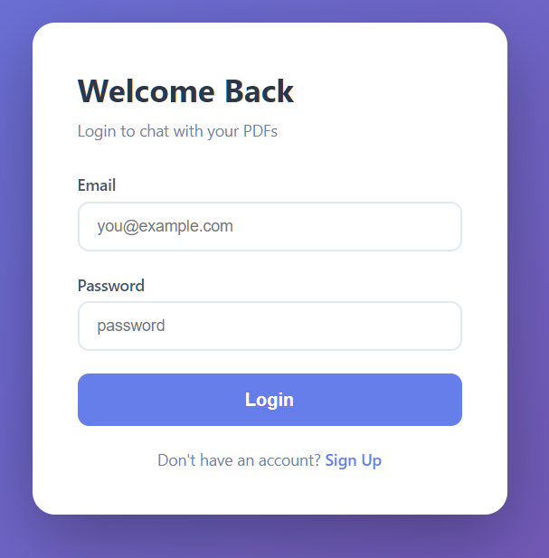
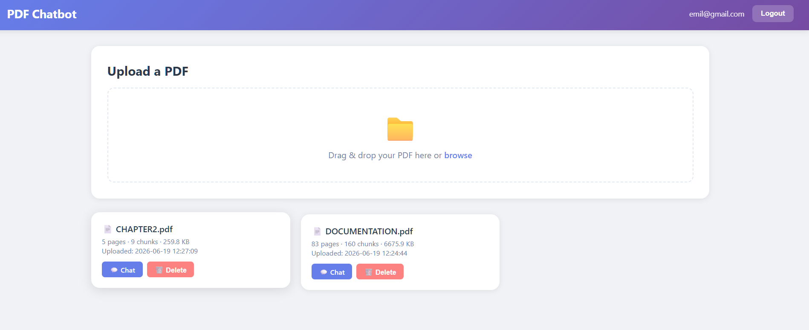
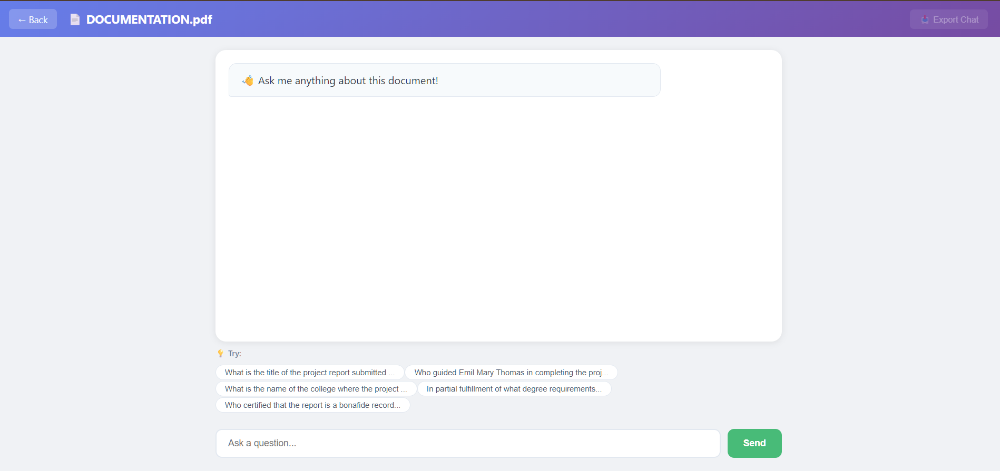
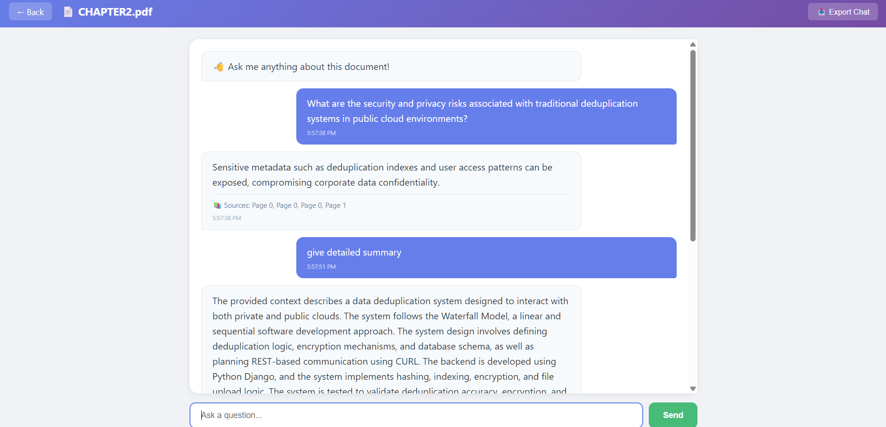

# 📄 RAG PDF Chatbot

A powerful document Q&A application that lets you upload PDFs and chat with them using AI. Built with Groq, ChromaDB, and FastAPI.


---

## ✨ Features

| Feature | Description |
|---------|-------------|
| 🔐 **User Authentication** | Sign up and login with secure password hashing (bcrypt) |
| 📤 **PDF Upload** | Drag and drop or browse to upload PDFs |
| 🤖 **AI-Powered Chat** | Ask questions about your PDFs using Groq's Llama 3.3 70B |
| 💾 **Chat History** | All conversations are saved per document |
| 💡 **Suggested Questions** | AI-generated questions about your document |
| 📥 **Export Chat** | Download conversations as .txt files |
| 🗑️ **Delete Documents** | Remove documents you no longer need |
| 📊 **Document Dashboard** | View all your documents with stats (pages, chunks, size) |
| 🌙 **Dark Mode Ready** | CSS variables make it easy to add |
| 📱 **Responsive** | Works on mobile and desktop |

---

## 📸 Screenshots

### Signup Page


### Login Page


### Dashboard


### Chat Interface


### Chat with Questions Interface

---

## 🛠️ Tech Stack

| Component | Technology |
|-----------|------------|
| **Backend** | FastAPI |
| **AI Model** | Groq (Llama 3.3 70B) |
| **Vector DB** | ChromaDB |
| **Embeddings** | HuggingFace (all-MiniLM-L6-v2) |
| **Auth** | bcrypt + session cookies |
| **Database** | SQLite |
| **Frontend** | HTML + CSS + JavaScript |

---

## 🚀 Quick Start

### Prerequisites

- Python 3.10 or higher
- Groq API Key (free at [console.groq.com](https://console.groq.com))

### Installation

```bash
# Clone the repository
git clone https://github.com/YOUR_USERNAME/rag-pdf-chatbot.git
cd rag-pdf-chatbot

# Create virtual environment
python -m venv venv

# Activate virtual environment
# On Windows:
venv\Scripts\activate
# On Mac/Linux:
source venv/bin/activate

# Install dependencies
pip install fastapi uvicorn groq chromadb pypdf python-dotenv \
    langchain langchain-community sentence-transformers \
    langchain-text-splitters bcrypt python-multipart

# Create .env file with your Groq API key
echo "GROQ_API_KEY=your_api_key_here" > .env
